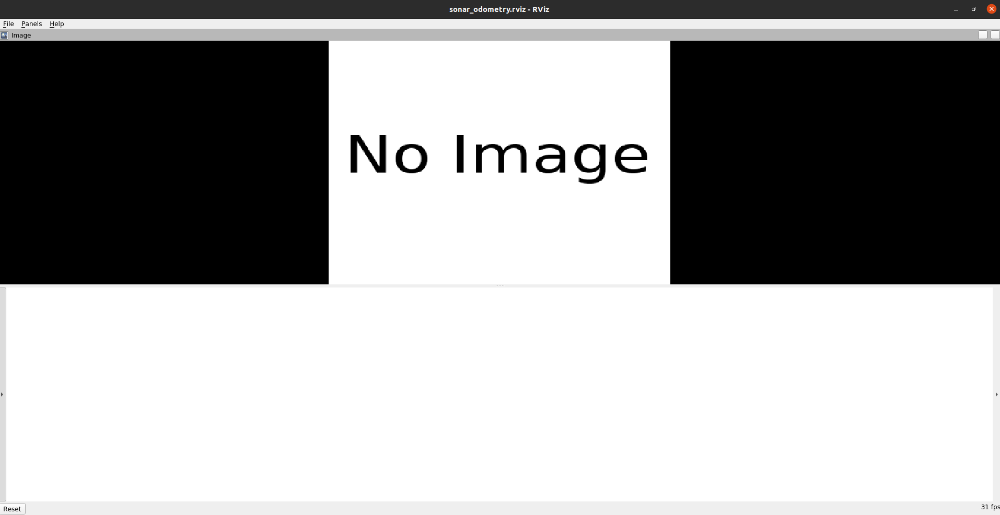

# DISO: Direct Imaging Sonar Odometry


Welcome to the **Direct Imaging Sonar Odometry (DISO)** system repository!

DISO is an advanced sonar odometry framework developed to enhance the accuracy and reliability of underwater navigation. It estimates the relative transformation between two sonar frames by minimizing aggregated sonar intensity errors at points with high intensity gradients. Key features include:
- **Diect Sonar Optimization**: Optimizes transformations between two sonar frames by minizing the overall acoustic intensity error.
- **Multi-sensor Window Optimization**: Optimizes transformations across multiple frames for robust trajectory estimation.
- **Data Association Strategy**: Efficiently matches corresponding sonar points to enhance accuracy.
- **Acoustic Intensity Outlier Rejection**: Filters out anomalous sonar readings for improved reliability.

## Linux Installation
We recommand using our docker compose file to build DISO and reproduce experiment result.

Installation has been test on **Ubuntu 20.04** and **ROS Noetic**.

### DISO Installation
```bash
mkdir -p diso_ws/src
cd diso_ws/src
git clone https://github.com/SenseRoboticsLab/DISO.git
cd ./DISO/docker
xhost +
docker compose up
```
It may take a few minutes to build the docker. You should have a rviz window jump out when it's done as follows:


### Dataset Preparation
Thanks the authors of [Aracati2017](https://github.com/matheusbg8/aracati2017) dataset for releasing their data. We updated the plot function to visualize our results on the aerial images.

Open a new terminal and follow the instruction to play data and visualize DISO:
```bash
#go to src of your catkin workspace
cd diso_ws/src
git clone https://github.com/SenseRoboticsLab/Aracati2017_DISO.git
```
Then download bag file from [Aracati2017 google drive](https://drive.google.com/file/d/1dbpfd3jElTdHmnceKE5RL8hzU-BDYaW-/view?usp=sharing), then place the bag file in the **diso_ws/src/Aracati2017_DISO/bags** folder.
```bash
cd ./Aracati2017_DISO/docker
docker compose up
```
## Paper
For more information, please read our [paper](https://ieeexplore.ieee.org/document/10611064)

## Citation
```
@INPROCEEDINGS{10611064,
  author={Xu, Shida and Zhang, Kaicheng and Hong, Ziyang and Liu, Yuanchang and Wang, Sen},
  booktitle={2024 IEEE International Conference on Robotics and Automation (ICRA)}, 
  title={DISO: Direct Imaging Sonar Odometry}, 
  year={2024},
  pages={8573-8579},
  doi={10.1109/ICRA57147.2024.10611064}}

```

## License

DISO is released under a GPLv3 license. For commercial purposes of DISO , please contact: sen.wang@imperial.ac.uk